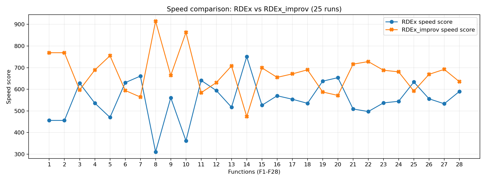

## TABLE:  Feasibility-aware final-quality ($Q_p$) on 28 CEC-2017 functions

| Problem | RDEx Mean | RDEx SD | RDEx_improv Mean | RDEx_improv SD | W |
|---|---|---|---|---|---|
| 1 | 1.83E-29 | 1.51E-29 | 6.82E-29 | 3.51E-29 | - |
| 2 | 1.85E-29 | 1.74E-29 | 5.98E-29 | 2.69E-29 | - |
| 3 | 2.65E+02 | 6.34E+01 | 2.54E+02 | 8.18E+01 | = |
| 4 | 1.63E+01 | 2.42E+00 | 8.69E+01 | 1.01E+01 | - |
| 5 | 1.23E-30 | 4.65E-30 | 1.59E-01 | 7.97E-01 | - |
| 6 | 5.53E+01 | 1.53E+02 | 3.70E+02 | 1.89E+02 | - |
| 7 | -1.01E+03 | 5.12E+02 | -8.67E+02 | 1.18E+02 | = |
| 8 | -2.84E-04 | 0.00E+00 | -2.84E-04 | 0.00E+00 | = |
| 9 | -2.67E-03 | 0.00E+00 | -2.67E-03 | 0.00E+00 | = |
| 10 | -1.03E-04 | 0.00E+00 | -1.03E-04 | 0.00E+00 | = |
| 11 | -4.83E+00 | 4.95E+00 | -2.46E+00 | 4.00E+00 | = |
| 12 | 9.31E+00 | 1.60E+00 | 1.50E+01 | 8.50E+00 | - |
| 13 | 1.35E-27 | 1.81E-27 | 2.58E+02 | 6.05E+02 | - |
| 14 | 1.42E+00 | 2.88E-02 | 1.42E+00 | 3.25E-02 | = |
| 15 | 5.87E+00 | 1.04E+00 | 5.87E+00 | 1.04E+00 | = |
| 16 | 2.19E+01 | 3.85E+00 | 2.09E+01 | 2.75E+00 | = |
| 17 | 3.29E+01 | 0.00E+00 | 3.29E+01 | 0.00E+00 | = |
| 18 | 3.65E+01 | 3.32E-05 | 3.67E+01 | 4.70E-01 | = |
| 19 | 4.28E+04 | 0.00E+00 | 4.28E+04 | 0.00E+00 | = |
| 20 | 1.39E+00 | 1.95E-01 | 2.58E+00 | 7.80E-01 | - |
| 21 | 2.93E+01 | 1.03E+01 | 1.72E+01 | 1.02E+01 | + |
| 22 | 5.76E-26 | 4.20E-26 | 5.52E+01 | 2.32E+02 | - |
| 23 | 1.41E+00 | 0.00E+00 | 1.41E+00 | 0.00E+00 | = |
| 24 | 5.50E+00 | 0.00E+00 | 5.62E+00 | 6.28E-01 | = |
| 25 | 2.48E+01 | 4.99E+00 | 2.87E+01 | 5.43E+00 | - |
| 26 | 3.30E+01 | 0.00E+00 | 3.30E+01 | 0.00E+00 | = |
| 27 | 3.65E+01 | 1.17E-04 | 3.67E+01 | 5.62E-01 | = |
| 28 | 4.28E+04 | 9.33E+00 | 4.28E+04 | 1.51E+01 | = |
| **W/T/L** |  |  |  |  | **1/17/10** |
| Holm-corrected | | | | | **0/21/7** |
| A12 median | | | | | **0.48** |

## TABLE: Time-to-target (TTT) on 28 CEC-2017 functions

| Problem | RDEx Mean | RDEx SD | RDEx_improv Mean | RDEx_improv SD | W |
|---|---|---|---|---|---|
| 1 | 451.1 | 9.9 | 343.5 | 14.4 | + |
| 2 | 462.7 | 8.8 | 347.9 | 18.1 | + |
| 3 | 1821.8 | 303.6 | 1656.6 | 408.7 | + |
| 4 | 353.2 | 31.8 | 1792.5 | 576.3 | - |
| 5 | 695.2 | 9.5 | 602.2 | 291.6 | + |
| 6 | 686.7 | 495.5 | 1676.7 | 665.3 | - |
| 7 | 1156.0 | 711.7 | 1310.8 | 841.2 | = |
| 8 | 770.0 | 12.7 | 536.2 | 17.1 | + |
| 9 | 801.8 | 7.6 | 814.6 | 6.0 | - |
| 10 | 793.3 | 12.5 | 591.2 | 100.0 | + |
| 11 | 1370.3 | 325.7 | 1429.4 | 366.7 | = |
| 12 | 614.1 | 254.6 | 1148.0 | 644.5 | - |
| 13 | 754.2 | 8.2 | 855.5 | 521.9 | = |
| 14 | 602.2 | 528.1 | 1199.2 | 435.9 | - |
| 15 | 857.6 | 531.2 | 1104.4 | 812.0 | = |
| 16 | 1151.0 | 777.7 | 962.2 | 775.4 | = |
| 17 | 60.7 | 4.1 | 39.3 | 1.6 | + |
| 18 | 1097.7 | 64.9 | 1129.5 | 286.1 | = |
| 19 | 745.2 | 38.0 | 815.2 | 18.8 | - |
| 20 | 1073.8 | 431.0 | 1830.2 | 399.6 | - |
| 21 | 578.9 | 437.2 | 375.6 | 368.7 | = |
| 22 | 907.1 | 19.8 | 1010.4 | 443.9 | = |
| 23 | 455.6 | 32.8 | 362.7 | 39.7 | + |
| 24 | 445.8 | 208.2 | 493.8 | 423.9 | = |
| 25 | 859.6 | 669.6 | 1421.6 | 727.0 | - |
| 26 | 73.4 | 3.6 | 49.8 | 1.4 | + |
| 27 | 1134.3 | 226.9 | 1116.0 | 336.7 | + |
| 28 | 1405.6 | 730.3 | 1398.9 | 598.5 | = |
| **W/T/L** |  |  |  |  | **10/10/8** |
| Holm-corrected | | | | | **8/15/5** |
| A12 median | | | | | **0.62** |

## TABLE: Complementary pairwise summary (RDEx_improv vs RDEx)

| Metric | W/T/L | Holm W/T/L | A12 median |
|---|---|---|---|
| Final Q (Table V) | 1/17/10 | 0/21/7 | 0.48 |
| TTT (Table VI) | 10/10/8 | 8/15/5 | 0.62 |
| Final Obj. | 1/16/11 | 0/20/8 | 0.48 |
| Final CV | 0/27/1 | 0/27/1 | 0.50 |
| AUC | 12/7/9 | 11/9/8 | 0.76 |

## TABLE: Friedman tests on per-function medians (2 algos)

| Metric | RDEx rank | RDEx_improv rank | χ² | df | p |
|---|---|---|---|---|---|
| Final Q | 1.41 | 1.59 | 0.89 | 1 | 0.345 |
| TTT | 1.61 | 1.39 | 1.29 | 1 | 0.257 |
| Final Obj. | 1.34 | 1.66 | 2.89 | 1 | 0.089 |
| Final CV | 1.52 | 1.48 | 0.04 | 1 | 0.85 |
| AUC | 1.61 | 1.39 | 1.29 | 1 | 0.257 |

## TABLE: Final objective comparison

| Problem | RDEx Mean | RDEx SD | RDEx_improv Mean | RDEx_improv SD | W |
|---|---|---|---|---|---|
| 1 | 1.83E-29 | 1.51E-29 | 6.82E-29 | 3.51E-29 | - |
| 2 | 1.85E-29 | 1.74E-29 | 5.98E-29 | 2.69E-29 | - |
| 3 | 2.65E+02 | 6.34E+01 | 2.54E+02 | 8.18E+01 | = |
| 4 | 1.63E+01 | 2.42E+00 | 8.69E+01 | 1.01E+01 | - |
| 5 | 1.23E-30 | 4.65E-30 | 1.59E-01 | 7.97E-01 | - |
| 6 | 1.17E+00 | 5.07E+00 | 2.54E+01 | 9.17E+01 | - |
| 7 | -1.01E+03 | 5.12E+02 | -8.67E+02 | 1.18E+02 | = |
| 8 | -2.84E-04 | 0.00E+00 | -2.84E-04 | 0.00E+00 | = |
| 9 | -2.67E-03 | 0.00E+00 | -2.67E-03 | 0.00E+00 | = |
| 10 | -1.03E-04 | 0.00E+00 | -1.03E-04 | 0.00E+00 | = |
| 11 | -4.83E+00 | 4.95E+00 | -2.46E+00 | 4.00E+00 | = |
| 12 | 9.31E+00 | 1.60E+00 | 1.50E+01 | 8.50E+00 | - |
| 13 | 1.35E-27 | 1.81E-27 | 1.44E+02 | 3.57E+02 | - |
| 14 | 1.42E+00 | 2.88E-02 | 1.42E+00 | 3.25E-02 | = |
| 15 | 5.87E+00 | 1.04E+00 | 5.87E+00 | 1.04E+00 | = |
| 16 | 2.19E+01 | 3.85E+00 | 2.09E+01 | 2.75E+00 | = |
| 17 | 8.19E-01 | 9.60E-02 | 8.13E-01 | 1.16E-01 | = |
| 18 | 3.65E+01 | 3.32E-05 | 3.67E+01 | 4.70E-01 | = |
| 19 | 0.00E+00 | 0.00E+00 | 0.00E+00 | 0.00E+00 | = |
| 20 | 1.39E+00 | 1.95E-01 | 2.58E+00 | 7.80E-01 | - |
| 21 | 2.93E+01 | 1.03E+01 | 1.72E+01 | 1.02E+01 | + |
| 22 | 5.76E-26 | 4.20E-26 | 3.69E+01 | 1.42E+02 | - |
| 23 | 1.41E+00 | 0.00E+00 | 1.41E+00 | 0.00E+00 | = |
| 24 | 5.50E+00 | 0.00E+00 | 5.62E+00 | 6.28E-01 | = |
| 25 | 2.48E+01 | 4.99E+00 | 2.87E+01 | 5.43E+00 | - |
| 26 | 8.39E-01 | 9.04E-02 | 8.59E-01 | 6.14E-02 | = |
| 27 | 3.65E+01 | 1.17E-04 | 3.67E+01 | 5.62E-01 | = |
| 28 | -4.42E+00 | 3.28E+00 | 1.58E+00 | 4.05E+00 | - |
| **W/T/L** |  |  |  |  | **1/16/11** |

## TABLE: Final constraint-violation comparison

| Problem | RDEx Mean | RDEx SD | RDEx_improv Mean | RDEx_improv SD | W |
|---|---|---|---|---|---|
| 1 | 0.00E+00 | 0.00E+00 | 0.00E+00 | 0.00E+00 | = |
| 2 | 0.00E+00 | 0.00E+00 | 0.00E+00 | 0.00E+00 | = |
| 3 | 0.00E+00 | 0.00E+00 | 0.00E+00 | 0.00E+00 | = |
| 4 | 0.00E+00 | 0.00E+00 | 0.00E+00 | 0.00E+00 | = |
| 5 | 0.00E+00 | 0.00E+00 | 0.00E+00 | 0.00E+00 | = |
| 6 | 1.51E-01 | 4.68E-01 | 2.14E+00 | 1.55E+00 | - |
| 7 | 0.00E+00 | 0.00E+00 | 0.00E+00 | 0.00E+00 | = |
| 8 | 0.00E+00 | 0.00E+00 | 0.00E+00 | 0.00E+00 | = |
| 9 | 0.00E+00 | 0.00E+00 | 0.00E+00 | 0.00E+00 | = |
| 10 | 0.00E+00 | 0.00E+00 | 0.00E+00 | 0.00E+00 | = |
| 11 | 1.82E-10 | 6.36E-10 | 5.67E-09 | 2.83E-08 | = |
| 12 | 0.00E+00 | 0.00E+00 | 0.00E+00 | 0.00E+00 | = |
| 13 | 0.00E+00 | 0.00E+00 | 7.07E+01 | 1.72E+02 | = |
| 14 | 0.00E+00 | 0.00E+00 | 0.00E+00 | 0.00E+00 | = |
| 15 | 0.00E+00 | 0.00E+00 | 6.32E-08 | 3.16E-07 | = |
| 16 | 0.00E+00 | 0.00E+00 | 0.00E+00 | 0.00E+00 | = |
| 17 | 3.10E+01 | 0.00E+00 | 3.10E+01 | 0.00E+00 | = |
| 18 | 0.00E+00 | 0.00E+00 | 0.00E+00 | 0.00E+00 | = |
| 19 | 4.27E+04 | 0.00E+00 | 4.27E+04 | 0.00E+00 | = |
| 20 | 0.00E+00 | 0.00E+00 | 0.00E+00 | 0.00E+00 | = |
| 21 | 0.00E+00 | 0.00E+00 | 0.00E+00 | 0.00E+00 | = |
| 22 | 0.00E+00 | 0.00E+00 | 1.82E+01 | 9.12E+01 | = |
| 23 | 0.00E+00 | 0.00E+00 | 0.00E+00 | 0.00E+00 | = |
| 24 | 0.00E+00 | 0.00E+00 | 0.00E+00 | 0.00E+00 | = |
| 25 | 0.00E+00 | 0.00E+00 | 0.00E+00 | 0.00E+00 | = |
| 26 | 3.10E+01 | 0.00E+00 | 3.10E+01 | 0.00E+00 | = |
| 27 | 0.00E+00 | 0.00E+00 | 0.00E+00 | 0.00E+00 | = |
| 28 | 4.28E+04 | 9.33E+00 | 4.28E+04 | 1.51E+01 | = |
| **W/T/L** |  |  |  |  | **0/27/1** |

## TABLE: Anytime convergence AUC over 2000 checkpoints

| Problem | RDEx Mean | RDEx SD | RDEx_improv Mean | RDEx_improv SD | W |
|---|---|---|---|---|---|
| 1 | 0.17 | 0.01 | 0.11 | 0.01 | + |
| 2 | 0.19 | 0.01 | 0.12 | 0.01 | + |
| 3 | 1.93 | 0.41 | 1.70 | 0.60 | = |
| 4 | 0.38 | 0.03 | 1.20 | 0.44 | - |
| 5 | 0.35 | 0.01 | 0.29 | 0.12 | + |
| 6 | 0.66 | 0.76 | 2.20 | 0.97 | - |
| 7 | 1.46 | 0.82 | 1.32 | 0.83 | = |
| 8 | 0.26 | 0.01 | 0.17 | 0.02 | + |
| 9 | 0.32 | 0.01 | 0.43 | 0.01 | - |
| 10 | 0.33 | 0.01 | 0.25 | 0.03 | + |
| 11 | 1.87 | 0.07 | 1.96 | 0.06 | - |
| 12 | 0.26 | 0.01 | 0.49 | 0.55 | = |
| 13 | 0.52 | 0.01 | 0.94 | 1.04 | = |
| 14 | 0.26 | 0.03 | 0.30 | 0.06 | - |
| 15 | 0.22 | 0.19 | 0.12 | 0.16 | + |
| 16 | 0.58 | 0.34 | 0.40 | 0.29 | + |
| 17 | 0.10 | 0.01 | 0.06 | 0.00 | + |
| 18 | 0.76 | 0.05 | 0.89 | 0.25 | - |
| 19 | 0.42 | 0.02 | 0.54 | 0.01 | - |
| 20 | 0.34 | 0.03 | 0.50 | 0.09 | - |
| 21 | 0.40 | 0.36 | 0.18 | 0.01 | + |
| 22 | 0.62 | 0.03 | 0.82 | 0.69 | = |
| 23 | 0.34 | 0.01 | 0.23 | 0.01 | + |
| 24 | 0.19 | 0.01 | 0.13 | 0.12 | + |
| 25 | 0.49 | 0.32 | 0.66 | 0.40 | = |
| 26 | 0.13 | 0.01 | 0.09 | 0.00 | + |
| 27 | 0.85 | 0.02 | 0.82 | 0.10 | = |
| 28 | 0.48 | 0.21 | 0.83 | 0.34 | - |
| **W/T/L** |  |  |  |  | **12/7/9** |

## Speed Comparision Graphs:
